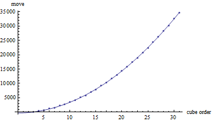
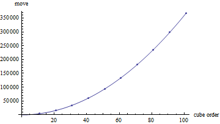
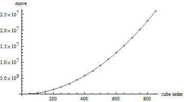
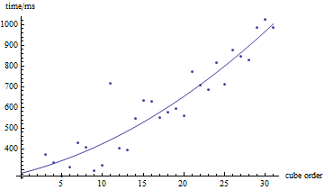
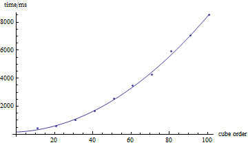
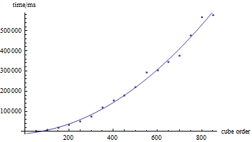

## 程序说明

### 环境

windows,vs2008

### 语言

c++

### 图形

opengl,glut

### 运行时，请在环境中增加，否则可能会影响操作流畅性

PATH=$(SolutionDir)glut\

### 其他

程序第一次运行时，会在当前目录下生成一些数据文件，由于有大量计算所以启动可能比较慢
以后的运行，会直接加载这些文件，所以会快很多

----

## 功能说明

### 键盘控制说明：

数字键2-9——选择对应阶的魔方 
s —— 自动还原魔方（2阶为最优解，3阶可能非最优解，不过一般少于30个face move，4阶及以上为模拟人工还原） 
r —— 重置魔方 
R —— 随机魔方 (该随机一定可解) 
t —— 透明魔方 
### 鼠标控制说明
拖拽魔方——魔方对应层旋转 
拖拽黑色背景——魔方整体旋转 

## 性能

* 移动数

* 时间

* 具体数据

|cube order | repeat time  total (s)| time average(ms)|	move average |
|---:|---:|---:|---:|
| 2 | 1000 | 0.007 | 0.007 |
| 3 | 100 | 37.449 | 374.49 |
| 4 | 50 | 16.695 | 333.9 |
| 5 | 50 | 13.516 | 270.32 |
| 6 | 50 | 15.617 | 312.34 |
| 7 | 50 | 21.543 | 430.86 |
| 8 | 50 | 20.381 | 407.62 |
| 9 | 50 | 14.685 | 293.7 |
| 10 | 50 | 16.008 | 320.16 |
| 11 | 50 | 35.858 | 717.16 |
| 12 | 50 | 20.17 | 403.4 |
| 13 | 50 | 19.681 | 393.62 |
| 14 | 50 | 27.282 | 545.64 |
| 15 | 50 | 31.797 | 635.94 |
| 16 | 50 | 31.525 | 630.5 |
| 17 | 50 | 27.643 | 552.86 |
| 18 | 50 | 28.863 | 577.26 |
| 19 | 50 | 29.651 | 593.02 |
| 20 | 50 | 27.923 | 558.46 |
| 21 | 50 | 38.591 | 771.82 |
| 22 | 50 | 35.416 | 708.32 |
| 23 | 50 | 34.338 | 686.76 |
| 24 | 50 | 40.879 | 817.58 |
| 25 | 50 | 35.642 | 712.84 |
| 26 | 50 | 43.829 | 876.58 |
| 27 | 50 | 42.42 | 848.4 |
| 28 | 50 | 41.459 | 829.18 |
| 29 | 50 | 49.304 | 986.08 |
| 30 | 50 | 51.157 | 1023.14 |
| 31 | 50 | 49.363 | 987.26 |
| 11 | 10 | 4.132 | 413.2 |
| 21 | 10 | 5.578 | 557.8 |
| 31 | 10 | 10.176 | 1017.6 |
| 41 | 10 | 16.372 | 1637.2 |
| 51 | 10 | 25.354 | 2535.4 |
| 61 | 10 | 34.48 | 3448 |
| 71 | 10 | 42.424 | 4242.4 |
| 81 | 10 | 58.974 | 5897.4 |
| 91 | 10 | 70.468 | 7046.8 |
| 101 | 10 | 84.932 | 8493.2 |
| 51 | 5 | 10.954 | 2190.8 |
| 101 | 5 | 43.207 | 8641.4 |
| 151 | 5 | 92.297 | 18459.4 |
| 201 | 5 | 163.375 | 32675 |
| 251 | 5 | 253.432 | 50686.4 |
| 301 | 5 | 365.872 | 73174.4 |
| 351 | 5 | 593.14 | 118628 |
| 401 | 5 | 765.271 | 153054 |
| 451 | 5 | 896.056 | 179211 |
| 501 | 5 | 1101.89 | 220377 |
| 551 | 5 | 1456.39 | 291278 |
| 601 | 5 | 1519.2 | 303840 |
| 651 | 5 | 1723.11 | 344621 |
| 701 | 5 | 1884.79 | 376958 |
| 751 | 5 | 2387.13 | 477426 |
| 801 | 5 | 2834.6 | 566920 |
| 851 | 5 | 2882.66 | 576532 |

----

## 自动还原算法

### 2阶还原

由于2阶魔方的状态数较少，所以把每种状态的深度，和当前的旋转动作，做成表，直接查找即可

### 3阶还原

two phase算法，具体参考 
http://kociemba.org/cube.htm

### n阶还原

模拟人工还原

## 随机打乱

根据[魔方的状态数公式](http://www.speedcubing.com/chris/cubecombos.html)
打乱算法理论上可以到达所有可解状态
